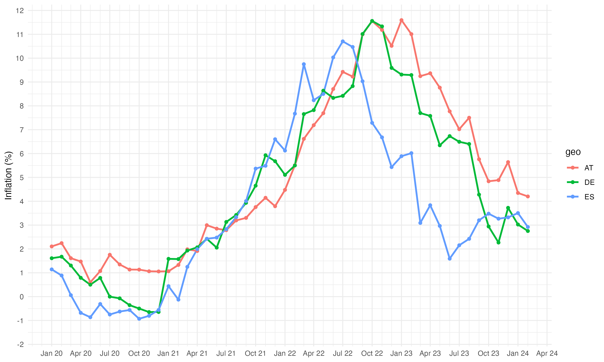

## Inflation of consumer prices

This repository uses R to fetch the official Harmonized Index of Consumer Prices (HICP) from [Eurostat](https://ec.europa.eu/eurostat) and create a time series plot of monthly inflation for selected countries. Note that I don't use the [annual rate of change data](https://ec.europa.eu/eurostat/databrowser/view/PRC_HICP_MANR__custom_3761882/default/table?lang=en) directly, but derive them manually from the annual HICP values.

The script produces a chart like this:

